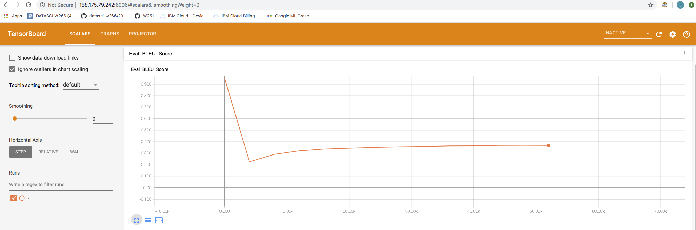
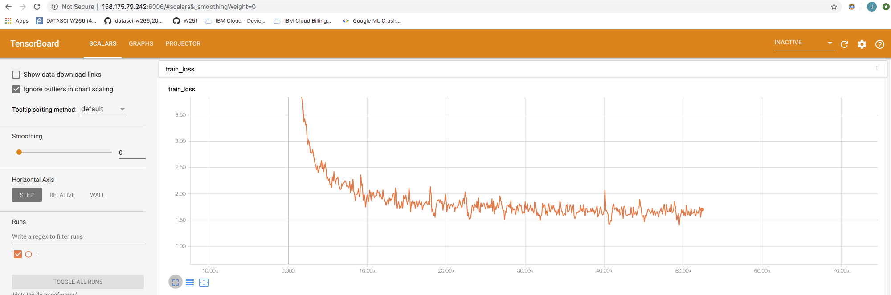
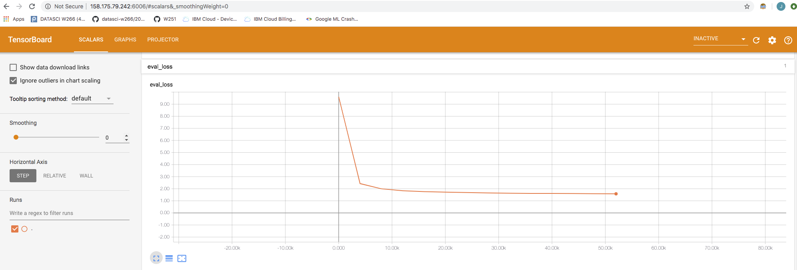
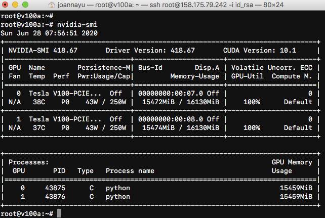
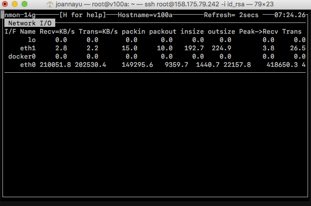
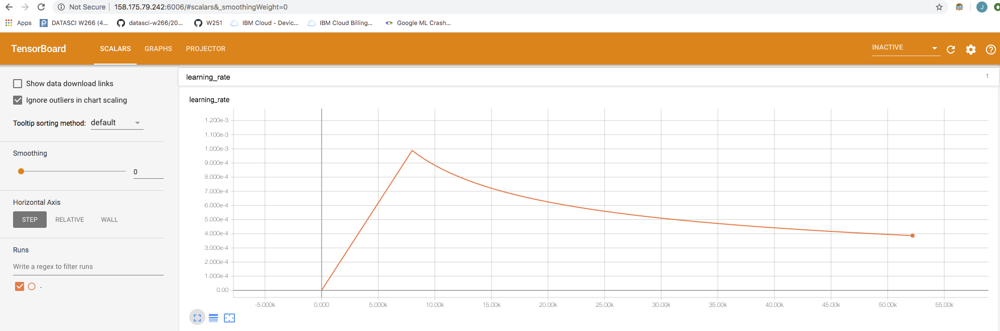
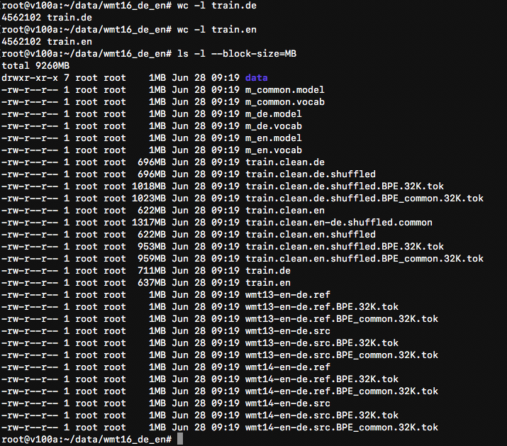

# Distributed Training and Neural Machine Translation

**Joanna Yu**

**Wednesday 4pm, Summer 2020**

## Introduction
Nvidia [OpenSeq2Seq](https://github.com/NVIDIA/OpenSeq2Seq/) is a framework for sequence to sequence tasks such as Automatic Speech Recognition (ASR) and Natural Language Processing (NLP), written in Python and TensorFlow. Many of these tasks take very long to train, hence the need to train on more than one machine.  In this assignment, we perform training [Transformer-based Machine Translation network](https://nvidia.github.io/OpenSeq2Seq/html/machine-translation/transformer.html) on a small English to German WMT corpus.

Training can be done using a pair of 2xP-100 or 2xV-100 VMs in Softlayer. A pair of P100 with 2TB disk cost ~$9/hour. A pair of V100 with 2TB disk cost ~$13/hour. Since V100s are about 3x faster than P-100s in mixed training, **V100s are selected for this assignment**. 

### Starting the VMs
#### P100a:
```
ibmcloud sl vs create --datacenter=lon06 --hostname=p100a --domain=w251hw9.cloud --image=2263543 --billing=hourly  --network 1000 --key=1810104 --flavor AC1_16X120X100 --san
```

#### P100b:
```
ibmcloud sl vs create --datacenter=lon06 --hostname=p100b --domain=w251hw9.cloud --image=2263543 --billing=hourly  --network 1000 --key=1810104 --flavor AC1_16X120X100 --san
```

#### V100a:
```
ibmcloud sl vs create --datacenter=lon04 --hostname=v100a --domain=w251hw9.cloud --image=2263543 --billing=hourly  --network 1000 --key=1810104 --flavor AC2_16X120X100 --san
```

#### V100b:
```
ibmcloud sl vs create --datacenter=lon04 --hostname=v100b --domain=w251hw9.cloud --image=2263543 --billing=hourly  --network 1000 --key=1810104 --flavor AC2_16X120X100 --san
```
*Note: running `nvidia-smi` will tell you how many GPUs you have in the VM instance.*

### Preparing the Second Disk
Once the VMs are created, log into IBM Cloud and add a 2TB drive in the `resize` menu in the device's detail page. It will also show how much the VMs cost per hour.

The following setup allows us to create a micro-cluster consisting of 2 nodes and four P-100 or V-100 GPUs total.

Use `fdisk` to see the name of the disk. 
```
fdisk -l
```

The output should be similar to this:
```
Disk /dev/xvdc: 2 TiB, 2147483648000 bytes, 4194304000 sectors
Units: sectors of 1 * 512 = 512 bytes
Sector size (logical/physical): 512 bytes / 512 bytes
I/O size (minimum/optimal): 512 bytes / 512 bytes
```

In this case, the disk is called /dev/xvdc.  It will need to be formatted:
```
# first
mkdir -m 777 /data
mkfs.ext4 /dev/xvdc
```

Add to /etc/fstab
```
# edit /etc/fstab and all this line:
/dev/xvdc /data                   ext4    defaults,noatime        0 0
```

Mount the disk
```
mount /data
```

### Create Cloud Containers for openseq2seq and Distributed Training

1. Create an account at https://ngc.nvidia.com/
2. Follow [these instructions](https://docs.nvidia.com/ngc/ngc-getting-started-guide/index.html#generating-api-key) to create an Nvidia Cloud docker registry API Key.
3. Login into one of the VMs and use the API key to login into Nvidia Cloud docker registry.
> * Log in to the NGC container registry: `sudo docker login nvcr.io`
> * When prompted for your user name, enter the following text: `$oauthtoken`
> * The `$oauthtoken` user name is a special user name that indicates that you will authenticate with an API key and not a user name and password.
> * When prompted for your password, enter your NGC API key as shown in the following example.
```
Username: $oauthtoken
Password: my-api-key
```
4. Pull the latest tensorflow image with python3: ```docker pull nvcr.io/nvidia/tensorflow:19.05-py3```
5. Use the files on [docker directory](docker) to create an openseq2seq image 
`docker build -t openseq2seq_image -f Dockerfile .`
6. Copy the created docker image to the other VM (or repeat the same steps on the other VM) 
7. Create containers on both VMs: ``` docker run --runtime=nvidia -d --name openseq2seq --net=host -e SSH_PORT=4444 -v /data:/data -p 6006:6006 openseq2seq_image ```
8. On each VM, create an interactive bash sesion inside the container: ``` docker exec -ti openseq2seq bash ``` and run the following commands in the container shell:

    i. Test MPI: ``` mpirun -n 2 -H <vm1 private ip address>,<vm2 private ip address> --allow-run-as-root hostname ``` 
    
    ii. Pull data to be used in neural machine translation training ([more info](https://nvidia.github.io/OpenSeq2Seq/html/machine-translation.html)):  
    ``` 
    cd /opt/OpenSeq2Seq 
    scripts/get_en_de.sh /data/wmt16_de_en
    ```
    iii. Copy configuration file to /data directory: ``` cp example_configs/text2text/en-de/transformer-base.py /data ```
    
    iv. Edit /data/transformer-base.py: replace ```[REPLACE THIS TO THE PATH WITH YOUR WMT DATA]``` with ```/data/wmt16_de_en/```,  in base_parms section replace ```"logdir": "nmt-small-en-de",``` with ```"logdir": "/data/en-de-transformer/",```  make "batch_size_per_gpu": 128, and the in eval_params section set "repeat": to True.
    
    v. When using V-100 GPUs, modify the config file to use mixed precision per the instructions in the file and set  "batch_size_per_gpu": 256 (One can fit twice as much data in memory when using 16-bit precision.)
    
    vi. Start training -- **on the first VM only:** ```nohup mpirun --allow-run-as-root -n 4 -H <vm1 private ip address>:2,<vm2 private ip address>:2 -bind-to none -map-by slot --mca btl_tcp_if_include eth0  -x NCCL_SOCKET_IFNAME=eth0 -x NCCL_DEBUG=INFO -x LD_LIBRARY_PATH  python run.py --config_file=/data/transformer-base.py --use_horovod=True --mode=train_eval & ```
    
    vii. Note that the above command starts 4 total tasks (-n 4), two on each node (-H <vm1 private ip address>:2,<vm2 private ip address>:2), asks the script to use horovod for communication, which in turn, uses NCCL, and then forces NCCL to use the internal nics on the VMs for communication (-x NCCL_SOCKET_IFNAME=eth0). MPI is only used to set up the cluster.
    
    viii. Monitor training progress: ``` tail -f nohup.out ```
    
    ix. Start tensorboard on the same machine where training started but will need to be inside the container: 
    ```
    docker exec -ti openseq2seq bash
    nohup tensorboard --logdir=/data/en-de-transformer
    ``` 
    Training progress can be monitored in browser http://public_ip_of_vm1:6006 
    
    x. Training was stopped by hand after the BLEU score was calculated after 52,000 steps. The config file will make the model run for 300,000 steps but training was killed by hand to conserve IBM credits. 
    
    xi. After training is done, the best model is downloaded to the Jetson TX2.  [Hint: it will be located in /data/en-de-transformer on the first VM]  Alternatively, one could always download a checkpoint from Nvidia [here](https://nvidia.github.io/OpenSeq2Seq/html/machine-translation.html)
       
```
scp -i 1810104 root@158.175.79.242:data/en-de-transformer/* ~/Downloads/
```

### Results
1. **How long does it take to complete the training run? (hint: this session is on distributed training, so it will take a while)**
> It took ~25 hours to do 52,000 steps on the V100s. 

2. **Do you think your model is fully trained? How can you tell?**
> I do not think the model is fully trained because the BLEU score is still increasing as shown below. 

> **BLEU Graph**


3. **Were you overfitting?**
> I do not think the model is overfitting since both `train_loss` and `eval_loss` are still dropping as shown below.

> **Train_Loss Graph**


> **Eval_loss Graph**


4. **Were your GPUs fully utilized?**
> Output from `nvidia-smi` indicates that both GPUs were fully utilized at 100%, as shown below.

> **nvidia-smi Screenshot**


5. **Did you monitor network traffic (hint: apt install nmon )? Was network the bottleneck?**
> Yes, I monitored the network traffic. The network does not seem to be the bottleneck based on the output from `nmon`, as shown below. The network is pretty fast.

> **nmon Screenshot**

>

6. **Take a look at the plot of the learning rate and then check the config file. Can you explain this setting?**
> **Learning Rate Graph**


> As seen in the graph, there is a period of ramp-up during the warm-up phase. And then the learning rate starts to decay.

7. **How big was your training set (mb)? How many training lines did it contain?**
> `train.de` is 711MB. `train.en` is 637MB. Each of these contains 4,562,102 lines.

> **Training Data Screenshot**

>

8. **What are the files that a TF checkpoint is comprised of?**
> A TF checkpoint is comprised of a data file, a meta file, and an index file. The data file contains the model weights.

9. **How big is your resulting model checkpoint (mb)?**
> The model checkpoint is 868MB. 

10. **Remember the definition of a "step". How long did an average step take?**
> On average, a step takes ~1.8 seconds.

11. **How does that correlate with the observed network utilization between nodes?**
> The network utilization was good, which resulted in fast training time.
